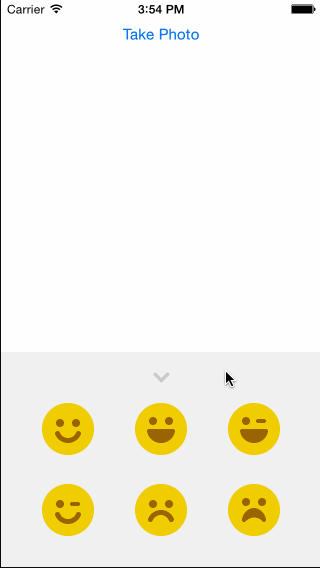

hw4
===

Week 4 Homework for Codepath

* ✘ Implemented scrollable tray of images (Not scrollable)
* ✔ You should be able to drag the tray up or down.
* ✔ Once the tray is revealed, you shouldn't be able to drag it any more.
* ✔ After releasing the tray, it should either move to its hidden position or its revealed position.
* ✔ Dragging an image from the tray should create a new copy of the image which can be dragged into the canvas area.
* ✔ Pinching images in the canvas area should resize them
* ✔ Optional: Allow the user to rotate the image
* ✔ Optional: Add a camera icon to the tray
* ✔ Optional: Tapping the camera icon opens the camera.
* ✔ Optional: After taking a picture, the picture is added to the view as a background view*

*Camera does not work in simulator, but does work on a connected device

A few things I'd like to note:
* I addded a double tap to delete action on newly created views
* New views cannot be created within the tray. This ensures that you always have access to tray items.

~12hrs work

